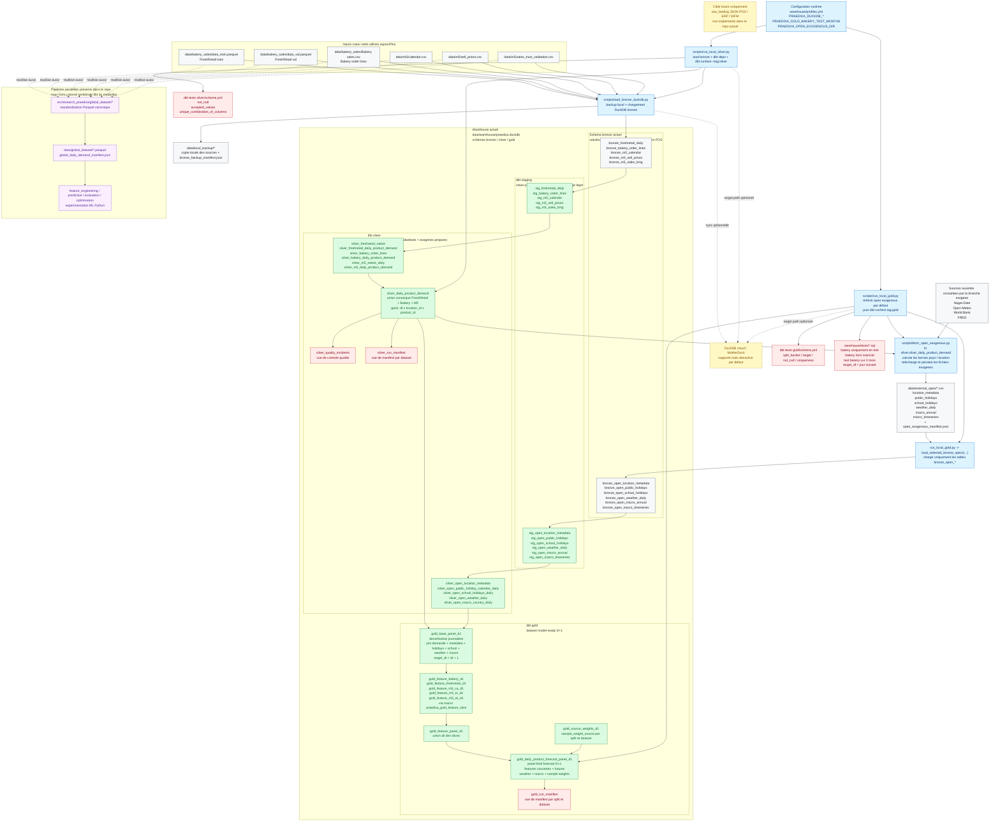

# Architecture Medaillon Actuelle

Ce document decrit l'architecture en medaillon reellement implemente aujourd'hui dans le repo.

Points importants :

- `raw_landing` JSON POS / ERP / WFM reste une cible d'architecture, pas une brique active du repo
- la `bronze` actuelle reste un schema DuckDB local de substitution alimente depuis `data/`
- la branche exogene ouverte fait maintenant partie du flux reel de la `gold`
- la `gold` n'est plus seulement `gold_base_panel_d1 -> gold_feature_panel_d1 -> gold_daily_product_forecast_panel_d1`
- elle passe maintenant par des slices `gold_feature_*` puis `gold_source_weights_d1`

## Schema visuel detaille

## Lecture rapide du schema

- Le flux medaillon actuel commence toujours dans `data/`, pas dans une vraie couche `raw_landing`.
- `scripts/load_bronze_duckdb.py` alimente le coeur `bronze` DuckDB de substitution et cree aussi un backup local.
- `scripts/run_local_gold.py` ajoute maintenant une vraie branche exogene : refresh des open data, ecriture dans `data/external_open/`, puis chargement des `bronze_open_*`.
- La couche `silver` ne contient plus seulement la demande canonique ; elle prepare aussi les tables exogenes consolidees par location, pays et date.
- `gold_base_panel_d1` joint desormais la demande dense avec metadata location, calendrier ferie, vacances scolaires, meteo et macro.
- La couche features `gold` est maintenant decoupee en slices par scope de split :
  - `bakery`
  - `freshretail`
  - `m5_ca`
  - `m5_tx`
  - `m5_wi`
- `gold_source_weights_d1` calcule les poids de source avant la publication du panel final `gold_daily_product_forecast_panel_d1`.
- Le dossier `src/research_praedixa/global_dataset/` existe toujours en parallele, mais ce n'est pas la colonne vertebrale du warehouse `dbt + DuckDB`.

## Frontieres importantes

- `bronze` actuelle :
  zone technique locale de substitution, pas encore une ingestion POS de production
- `silver` :
  verite operationnelle standardisee + preparation des exogenes exploitables
- `gold` :
  panel model-ready pour la prevision de demande `D+1`, enrichi par signaux ouverts et decoupe par slices de split
- `raw_landing` :
  cible future explicite mais non implementee
