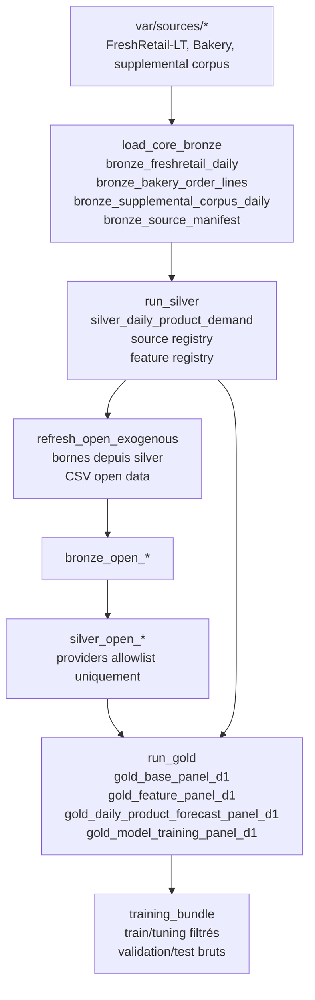

# Architecture Médaillon Actuelle

Le médaillon actif est local, DuckDB/dbt-first, et orienté prévision D+1. La
source de vérité aval est `gold.gold_model_training_panel_d1`, pas les anciens
parquets intermédiaires.

## Responsabilités

- `raw_landing`: cible de production append-only, désormais représentée par le
  manifest bronze local. Une vraie ingestion POS/ERP/WFM reste une évolution.
- `bronze`: projection locale typée des sources, avec `source_name`,
  `source_policy_id`, hash, row count et manifest persistant.
- `staging`: cast et normalisation minimale, sans règle métier lourde.
- `silver`: contrat opérationnel non agrégé au grain
  `dataset_source x dt x location_id x product_id`, plus tables de gouvernance
  et exogènes autorisées. Si deux flux autorisés alimentent la même clé métier,
  Silver garde une seule ligne via une priorité déterministe: bronze direct puis
  corpus supplemental.
- `gold`: dataset ML D+1, avec labels alignés dans le futur, disponibilité
  temporelle explicite et contrat consommable par le bundle. Le split actif est
  `freshretail`/`freshretail_lt` en `train`/`val` chronologique 60/40, et
  `bakery` en `test` uniquement sur les 3 derniers mois.
- `training_bundle`: filtre les lignes train/tuning non éligibles et conserve un
  rapport d'exclusion. Le `val` gold devient `tuning.parquet`; le `test` gold
  devient `valid.parquet`, utilisé comme holdout final d'évaluation.

## Points Critiques

- FreshRetail-LT conserve `dataset_source = freshretail_lt` via
  `source_policy_id`; il ne doit pas redevenir silencieusement `freshretail`.
- Les providers open-data doivent être présents dans l'allowlist
  `silver_allowed_provider_sources`; quarantaine et sources inconnues sont
  exclues avant silver exogène.
- `decision_timestamp` représente la fin du jour D; `target_dt = dt + 1`.
- `target_semantics = observed_sales` tant que la demande latente n'est pas
  reconstruite explicitement.
- Les zéros densifiés et jours fermés/missing ne sont pas utilisables pour
  l'entraînement.
