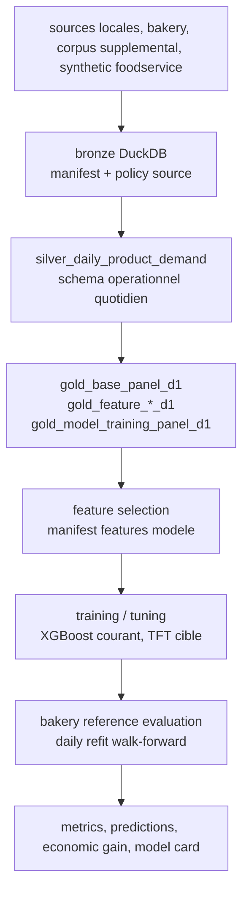

# Architecture Demand Forecast

Ce document explique la surface actuelle du produit `demand_forecast`. Le but
court terme est de prevoir la demande et les besoins operationnels sur des
activites alimentaires perissables. La vision long terme reste decisionnelle,
mais le repo actuel prouve d'abord un pipeline de prevision auditable.

## Flux Canonique



## Couches

### Warehouse

Le warehouse local est `DuckDB + dbt`. La table aval de reference est:

```text
gold.gold_model_training_panel_d1
```

Elle porte le panel quotidien au grain:

```text
dataset_source x dt x location_id x product_id
```

Les tables Gold actives sont documentees dans
[Couche Gold](../data_engineering/medaillon/gold.md).

### Produit Demand Forecast

La logique produit vit dans:

- `products/demand_forecast/src/praedixa/demand_forecast/training/`
- `products/demand_forecast/src/praedixa/demand_forecast/training_bundle/`
- `products/demand_forecast/src/praedixa/demand_forecast/feature_selection/`
- `products/demand_forecast/src/praedixa/demand_forecast/evaluation/`
- `products/demand_forecast/src/praedixa/demand_forecast/backends/`

Les wrappers executables sont dans `apps/demand_forecast/`.

## Contrat De Cible

Le run XGBoost courant utilise un contrat residuel:

| Champ | Valeur |
| --- | --- |
| cible d'apprentissage | `target_residual_field_blend_lag_1_lag_7_d_plus_1` |
| cible absolue reconstruite | `target_demand_qty_d_plus_1` |
| transformation | `additive_residual` |
| ancre de reconstruction | `field_baseline_blend_lag_1_lag_7_d_plus_1` |

Le modele apprend donc un residu autour d'une baseline terrain
`lag_1 / lag_7`, puis reconstruit une prediction absolue.

## Backends

### XGBoost

XGBoost est le backend courant le plus exploitable pour l'evaluation bakery.
Il supporte:

- entrainement sur le panel Gold;
- selection de features;
- refit quotidien en walk-forward;
- reconstruction de cible additive;
- evaluation economique vs baseline.

### TFT

TFT reste le backend cible pour un modele global plus riche, mais il n'est pas
encore le chemin de reference de bout en bout. Les contrats de features, roles,
normalizers et artefacts sont durcis pour cette transition.

### Foundation Models

TimesFM, Chronos-2 et Moirai existent comme surfaces experimentales
d'evaluation. Les resultats precedents montrent qu'ils ne battent pas la
baseline terrain en zero-shot sur bakery. Ils servent de contexte de recherche,
pas de backend promu.

## Invariants Anti-Leakage

Le repo doit respecter ces invariants:

- split temporel strict par date;
- aucune ligne test bakery future dans le fit initial;
- fit des normalizers/encoders uniquement sur train quand ils existent;
- features derivees du target alignees sur l'information disponible a `dt`;
- exogenes observees non traitees comme connues si elles ne le sont pas au
  moment de decision;
- evaluation quotidienne qui ajoute uniquement l'historique deja observe.

Le controle local recent n'a pas remonte d'alerte anti-leakage sur le protocole
XGBoost documente ici. Cela ne remplace pas un gate CI permanent: les invariants
doivent rester testes a chaque changement de feature engineering ou de split.

## Lecture Produit

Le repo ne doit pas etre presente comme un dashboard ou une BI. Sa valeur vient
de la capacite a transformer des historiques operationnels en decisions plus
economiques: moins d'invendus, moins de ruptures, meilleur cout matiere et
meilleure adequation operationnelle.
